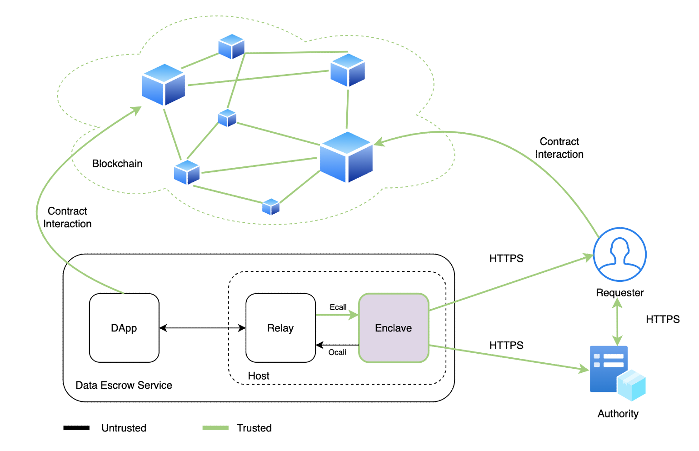
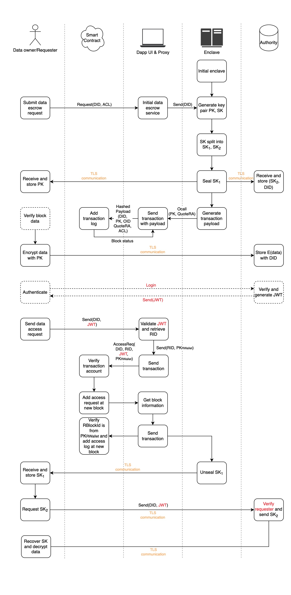
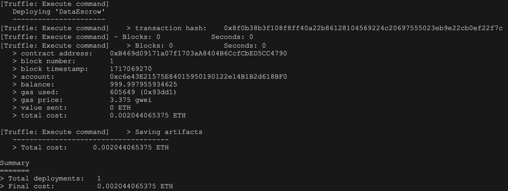
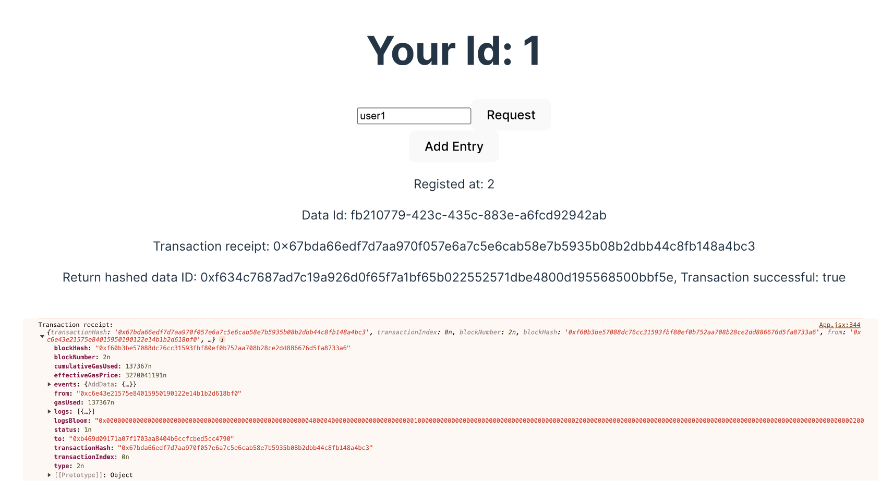
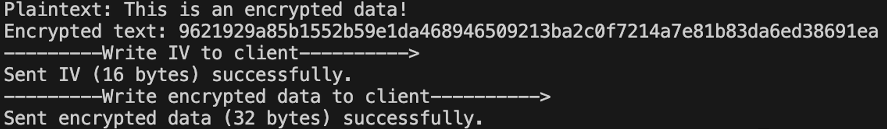
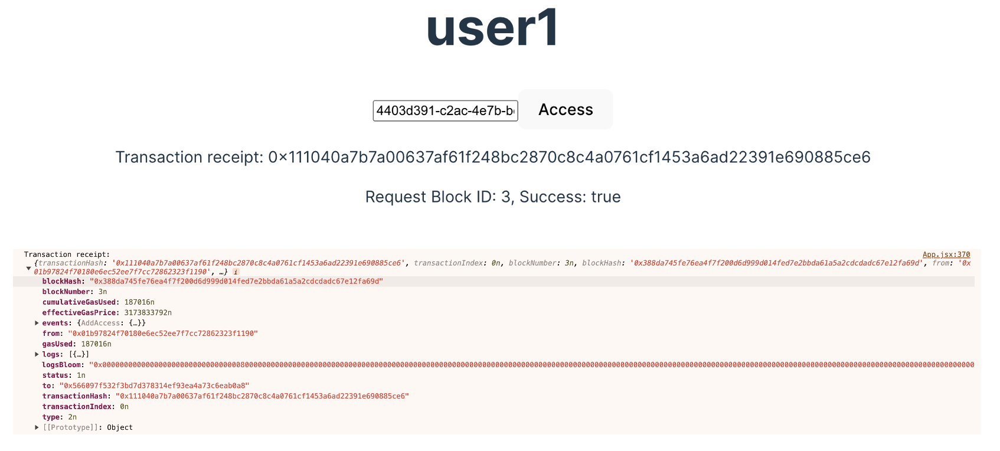
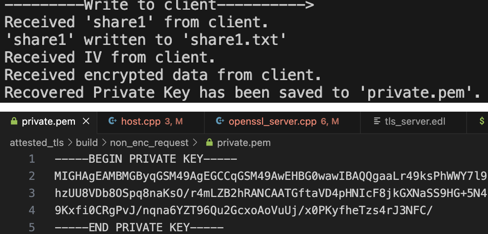

# Data Escrow with Intel SGX and blockchain

We present an enhanced secure data escrow solution that integrates hardware and blockchain technologies to address the vulnerabilities of traditional escrow systems, such as system compromises and bankruptcy. Our innovative approach protects private data within an Intel Software Guard Extensions (SGX) enclave and employs Shamir's Secret Sharing to divide and securely store the private key. This dual method significantly enhances the security of sensitive data. Additionally, we utilize smart contracts executed on the Ethereum blockchain to maintain the integrity and authenticity of access logs. All data exchanges from within the enclave occur over a trusted Transport Layer Security (TLS) connection, further securing data in transit. This paper outlines the system's architecture, delves into implementation challenges, and discusses potential areas for future enhancements, aiming to strengthen the robustness and reliability of data escrow systems.

It has the following properties:

- **Attested TLS communication**:
  - Establishes a secure communication channel between an enclave application and a non-enclave application, ensuring data integrity and confidentiality.
- **Confidential data processing**:
  - Private data is securely processed within the SGX enclave, preventing unauthorized access even in the case of system compromise.
- **Shamir’s Secret Sharing**:
  - The private key is split into multiple shares using Shamir's Secret Sharing algorithm, and securely stored across different entities to prevent single-point failures.
- **Smart contract integration**:
  - Smart contracts on the Ethereum blockchain are used to log access requests and maintain immutable records, ensuring transparency and auditability of data access.
- **Scalability and resilience**:
  - The system is designed to be scalable across multiple users and use cases, with mechanisms in place to ensure resilience against common escrow vulnerabilities like bankruptcy or collusion.
- **End-to-end encryption**:
  - All data transfers are encrypted, both in transit (via TLS) and at rest (using Shamir’s Secret Sharing and enclave encryption mechanisms).

## Architecture

A data escrow service consists of an enclave that generates and distributes keys, a relay that invokes the enclave, a DApp that interacts with the blockchain, and a third party that hosts the data. Below image shows a complete data escrow architecture, the enclave hosts the generation of ECC key pairs and the splitting of private keys, and builds trusted channels to complete secret sharing. Other untrusted components only undertake the processing, sending and recording of insensitive data.



### Data Escrow Service Component

#### Enclave Application

As one of the most critical features of the system, enclave application provides the most basic level of trust for the entire system. The following secret computations will be performed by the enclave: (i) Generate ECC key pair and split secret key into shares. (ii) Perform an extend certification for peer’s verification. (iii) Prepare necessary payload through a Ecall send to replay app. (iv) Establish secure channel based on TLS connection.

#### Relay

A backend server to handle DApp’s request and provide interface functions for enclaves’ communication. The following features will be performed by the relay app: (i) Communicate with DApp with HTTP endpoints. (ii) Invoke enclave function to finish the secret computing process. (iii) Create and destroy enclave environment. (iv) Store sealed blob.

#### DApp

A frontend service to provide simple operations for users, integrate with blockchain libraries, interact with deployed smart contract. It has the following abilities: (i) Display necessary information and retrieve data from the user. (ii) Interact with relay app via HTTP endpoints. (iii) Available to log transactions on the smart contract.

#### Authority

Authority as a place for data storage, we need a third party as a data storage organisation mainly because of the issue of storage size limitations within the enclave mentioned above. In addition to storing data, authority also serves the purpose of authorisation and authentication of the requesting party, through the JSON Web Token to ensure the requester’s authentication.

#### Smart Contract on Blockchain

Smart contracts record various actions during the data custodianship process, and transactions are saved to the blockchain through predefined functions. Different user requests will be reflected on different blocks, allowing users to independently verify on the blockchain whether their transactions have been completely recorded. When they need to trace their data, users can also complete the verification through similar operations.

#### Requester

As data requesters, users send their data requests to the data escrow system via a DApp. They receive a public key provided by the enclave for encrypting sensitive data. When users or authorized requesters need to retrieve the encrypted data, they obtain different shares from the enclave and the authority. These shares are used to recover the private key, which can then be used to decrypt the data.

### Workflow

To help to understand the workflow of our data escrow system, we break down the complete escrow process into following phases.



## Getting Started

This document provides instructions for setting up and deploying the Data Escrow smart contract, building and running the SGX server, and simulating the workflow.

### Platform

- **Ubantu 20.04-LTS 64-bit**
- SGX-capable system
  - You can use a VM with the required features ([Azure Confidential Compute](https://azure.microsoft.com/en-us/solutions/confidential-compute/) in this case).
  - Alternatively, set up your own device with Intel SGX enabled.

### Requirements

- [Open Enclave SDK](https://github.com/openenclave/openenclave?tab=readme-ov-file)
- [Ganache](https://github.com/trufflesuite/ganache-ui)
- React v18.x
- [CrowCpp](https://github.com/CrowCpp/Crow) v1.2.0

### Deploy Smart Contract on Ganache

Compile the smart contract under **`/contracts/DataEscrow.sol`**

```
truffle compile
```

Deploy the contract

```
truffle migrate
```

#### Setting up DApp

1. **Update ABI**: Replace the `const contractABI = [...]` in your DApp by copying the ABI from `/build/contracts/DataEscrow.json`.

2. **Update Contract Address**: Replace the `const contractAddress = ...` by copying the contract address generated after deploying the smart contract on Ganache.

3. **Start** the DApp

```
npm install
npm run build
```

### Build and Run SGX server

**Inside the attested_tls folder**, create a build directory and compile the server:

```
mkdir build
cd build
cmake -DOE_CRYPTO_LIB=openssl_3 ..
make
```

#### Server application

- Host part (tls_server_host)
  - Instantiate an enclave before transitioning the control into the enclave via an **ecall**.
  - Receive and response HTTP request from DApp
- Enclave (tls_server_enclave.signed)
  - Call oe_get_attestation_certificate_with_evidence to generate an certificate
  - Use the OpenSSL API to configure a TLS server using the generated certificate
  - Call generate_and_return_key_pair() to generate ECC key pair
  - Split private key into two parts by calling get_shares(), which implements the Shamir Secret Sharing algorithm
  - Launch a TLS server and wait for client connection request
  - Read client payload and reply with server payload
- How to launch a server instance

```
../server/host/tls_server_host ../server/enc/tls_server_enc.signed -port:12341
```

#### Non-enclave Client (Authority) application

- When used in this scenario, this non-enclave client is assumed to be a trusted party holding secrets and only shares it with the server after the server is validated
- Connect to server port via socket
- Use OpenSSL API to configure a TLS client
- Call oe_verify_attestation_certificate_with_evidence to validate server's certificate
- Send client payload and wait for server's payload

```
./tls_non_enc_client -server:localhost -port:12341
```

#### Non-enclave request (Requester/User) application

- When used in this scenario, this non-enclave client is assumed to be a trusted party holding secrets and only shares it with the server after the server is validated
- Connect to server port via socket
- Use OpenSSL API to configure a TLS client
- Call oe_verify_attestation_certificate_with_evidence to validate server's certificate
- Send client payload and wait for server's payload

```
./tls_non_enc_request -server:localhost -port:12341
```

#### Workflow Simulation

To simulate the interaction between the user, authority, and the blockchain:

1. **Relay (Server):** Start the enclave to await future operations

```
../server/host/tls_server_host ../server/enc/tls_server_enc.signed  -port:12341
```

2. **User:** Request a data escrow service and establish a TLS connection to receive the public key

```
./tls_non_enc_request -server:localhost -port:12341
```

3. **Authority:** Establish a TLS connection to receive the second private key share.

```
./tls_non_enc_client -server:localhost -port:12341
```

4. **User:** Encrypt data using the public key, and wait for the authority to receive the encrypted data.

```
./encryptdata
```

5. **Authority:** Securely store the encrypted data.

```
./recieveEncryptedData
```

6. **User:** Request access to the stored data and establish a TLS connection to receive the first key share.

```
./tls_non_enc_request -server:localhost -port:12341
```

7. **Authority:** Establish a connection with the user and share the required key parts.

```
./mainclient
```

9. **User:** Recover the full key and decrypt the data.

```
./main
```

## Screenshots










